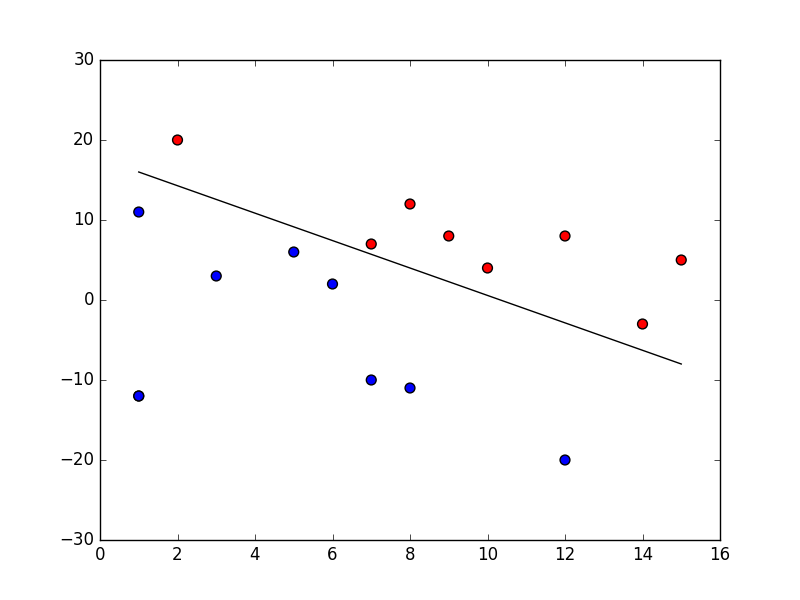
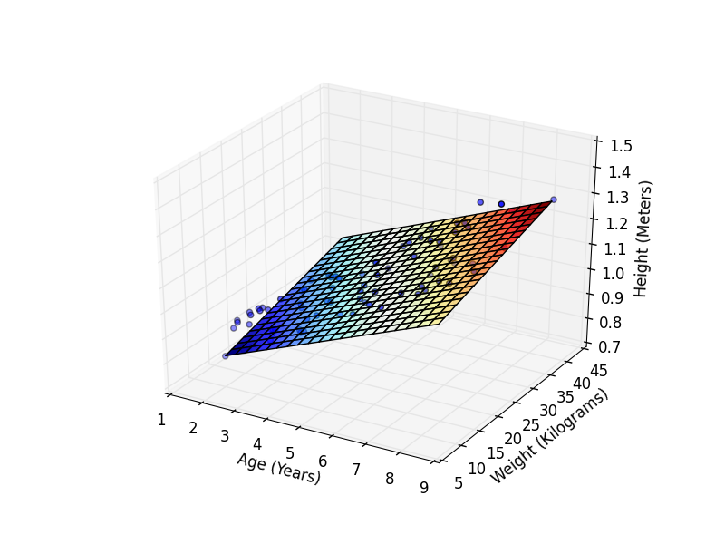
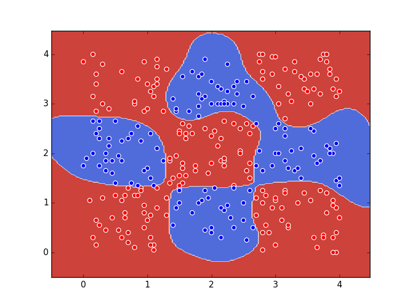

# **Week 7 Project: Machine Learning**

## **Instructions**

There are three parts to this assignment. Please read all sections of the instructions carefully.

1. **`Perceptron Learning Algorithm`** (50 points)
2. **`Linear Regression`** (50 points)
3. **`Classification`** (100 points)

You are allowed to use Python packages to help you solve the problems and plot any results for reference, including **numpy**, **scipy**, **pandas** and **scikit-learn**. For optional problems, you may find **matplotlib** package useful.

However, please do NOT submit any code using Tkinter, matplotlib, seaborn, or any other plotting library. **This will make your code fail on Vocareum**. This is because Vocareum does not have a display, so you can't actually produce a pop-up window with your plots, the way you can on your local machine.

**Bonus Points**: 

Submitting project 3 before `04/12/2020, 23:30 UTC` is eligible for bonus points (we count grades on your latest submission). Due to edX policy, all assignment grades are capped at 100%.

The assignment's final due date is `5/17/2020, 23:30 UTC`. 

---

## **I. Perceptron Learning Algorithm**

In this question, you will implement the perceptron learning algorithm ("PLA") for a linearly separable dataset. In your starter code, you will find `input1.csv`, containing a series of data points. Each point is a comma-separated ordered triple, representing **feature_1**, **feature_2**, and the **label** for the point. You can think of the values of the features as the `x` and `y` coordinates of each point. The label takes on a value of positive or negative one. You can think of the label as separating the points into two categories.

Implement your PLA in a file called `problem1.py`, which will be executed like so:

```bash
$ python3 -m venv venv && source venv/bin/activate && pip install -r requirements.txt
$ python problem1.py input1.csv output1.csv
```

This should generate an output file called `output1.csv`. With each iteration of your PLA (each time we go through all examples), your program must print a new line to the output file, containing a comma-separated list of the weights w_1, w_2, and b in that order. Upon convergence, your program will stop, and the final values of **w_1**, **w_2**, and **b** will be printed to the output file (see [**example**](example_output_files/output1.csv)). This defines the **decision boundary** that your PLA has computed for the given dataset.

Note: When implementing your PLA, in case of tie (sum of w_jx_ij = 0), please follow the lecture note and classify the datapoint as -1.

**What to Submit** `problem1.py`, which should behave as specified above. Before you submit, the **RUN** button on Vocareum should help you determine whether or not your program executes correctly on the platform.



**Optional (0 pts)**. To visualize the progress and final result of your program, you can use **matplotlib** to output an image for each iteration of your algorithm. For instance, you can plot each category with a different color, and plot the decision boundary with its equation. An example is shown above for reference

---

## **II. Linear Regression**

In this problem, you will work on linear regression with multiple features using gradient descent. In your starter code, you will find `input2.csv`, containing a series of data points. Each point is a comma-separated ordered triple, representing **age**, **weight**, and **height** (derived from CDC growth charts data).

**Data Preparation and Normalization**. Once you load your dataset, explore the content to identify each feature. Remember to add the vector 1 (intercept) ahead of your data matrix. You will notice that the **features** are not on the same scale. They represent age (years), and weight (kilograms). What is the mean and standard deviation of each feature? The last column is the **label**, and represents the height (meters). **Scale** each feature (i.e. age and weight) by its (population) standard deviation, and set its mean to zero. (Can you see why this will help?) You do not need to scale the intercept. (Can you see why this is unnecessary?)

For each feature x (a column in your data matrix), use the following formula for scaling:

<p align="center">

</p>

**Gradient Descent**. Implement gradient descent to find a regression model. Initialize your 's to zero. Recall the empirical risk and gradient descent rule as follows:

<p align="center">

</p>

<p align="center">

</p>

Run the gradient descent algorithm using the following **learning rates**: . For each value of , run the algorithm for exactly **100 iterations**. Compare the convergence rate when  is small versus large. What is the ideal learning rate to obtain an accurate model? In addition to the nine learning rates above, come up with **your own choice** of value for the learning rate. Then, using this new learning rate, run the algorithm for your own choice number of iterations.

Implement your gradient descent in a file called `problem2.py`, which will be executed like so:

```bash
$ python3 problem2.py input2.csv output2.csv
```

This should generate an output file called `output2.csv`. There are **ten cases** in total, nine with the specified learning rates (and 100 iterations), and one with your own choice of learning rate (and your choice of number of iterations). After each of these ten runs, your program must print a new line to the output file, containing a comma-separated list of **alpha**, **number_of_iterations**, **b_0**, **b_age**, and **b_weight** in that order (see [**example**](example_output_files/output2.csv)), please do not round you your numbers. These represent the regression models that your gradient descents have computed for the given dataset.

**For the output, please follow the exact format, with no extra commas, change in upper/lower case etc**. Extra unnecessary commas may make the automated script fail and result in you losing points.

**What To Submit**. `problem2.py`, which should behave as specified above. Before you submit, the **RUN** button on Vocareum should help you determine whether or not your program executes correctly on the platform.



**Optional (0 pts)**. To visualize the result of each case of gradient descent, you can use **matplotlib** to output an image for each linear regression model in three-dimensional space. For instance, you can plot each feature on the xy-plane, and plot the regression equation as a plane in xyz-space. An example is shown above for reference.

---

## **III. Classification**

In this problem you will use the support vector classifiers in the **sklearn** package to learn a classification model for a chessboard-like dataset. In your starter code, you will find `input3.csv`, containing a series of data points. Open the dataset in python. Make a scatter plot of the dataset showing the two classes with two different patterns.

Use SVM with different kernels to build a classifier. Make sure you split your data into **training** (60%) and **testing** (40%). Also make sure you use **stratified sampling** (i.e. same ratio of positive to negative in both the training and testing datasets). Use **cross validation** (with the number of folds *k = 5*) instead of a validation set. You do not need to scale/normalize the data for this question. Train-test splitting and cross validation functionalities are all readily available in sklearn.

* **SVM with Linear Kernel**. Observe the performance of the SVM with linear kernel. Search for a good setting of parameters to obtain high classification accuracy. Specifically, try values of C = [0.1, 0.5, 1, 5, 10, 50, 100]. Read about **sklearn.grid_search** and how this can help you accomplish this task. After locating the optimal parameter value by using the training data, record the corresponding **best score** (training data accuracy) achieved. Then apply the testing data to the model, and record the actual **test score**. Both scores will be a number between zero and one.

* **SVM with Polynomial Kernel**. (Similar to above).<br>
Try values of C = [0.1, 1, 3], degree = [4, 5, 6], and gamma = [0.1, 0.5].

* **SVM with RBF Kernel**. (Similar to above).<br>
Try values of C = [0.1, 0.5, 1, 5, 10, 50, 100] and gamma = [0.1, 0.5, 1, 3, 6, 10].

* **Logistic Regression**. (Similar to above).<br>
Try values of C = [0.1, 0.5, 1, 5, 10, 50, 100].

* **k-Nearest Neighbors**. (Similar to above).<br>
Try values of n_neighbors = [1, 2, 3, ..., 50] and leaf_size = [5, 10, 15, ..., 60].

* **Decision Trees**. (Similar to above).<br>
Try values of max_depth = [1, 2, 3, ..., 50] and min_samples_split = [2, 3, 4, ..., 10].

* **Random Forest**. (Similar to above).<br>
Try values of max_depth = [1, 2, 3, ..., 50] and min_samples_split = [2, 3, 4, ..., 10].

**What To Submit**. `output3.csv` (see [**example**](./example_output_files/output3.csv)). **Please follow the exact format, with no extra commas, change in upper/lower case etc.** Extra unnecessary commas may make the automated script fail and result in you losing points. There is no need to submit your actual program. The file should contain an entry for each of the seven methods used. For each method, print a comma-separated list as shown in the example, including the **method name**, **best score**, and **test score**, expressed with as many decimal places as you please. There may be more than one way to implement a certain method, and we will allow for small variations in output you may encounter depending on the specific functions you decide to use.



**Optional (0 pts)**. To visualize the result of each case of classification method, you can use **matplotlib** to output an image containing the data points and boundaries of each method. An example output showing the result of SVM with RBF kernel is shown above for reference.

## **BEFORE YOU SUBMIT**
* **Make sure** your code executes without fail on Vocareum. In particular, make sure you name your file correctly according to the instructions specified above, especially regarding different Python versions.

* **Bonus Credits for Early Submission:**  If you finish this project assignment before **April 12th 2020 23:30 UTC**  you will get extra credits for this homework as a bonus (we count grades on your latest submission). Due to edX policy, all assignment grades are capped at 100%.

* **You have an unlimited number of submissions**.
